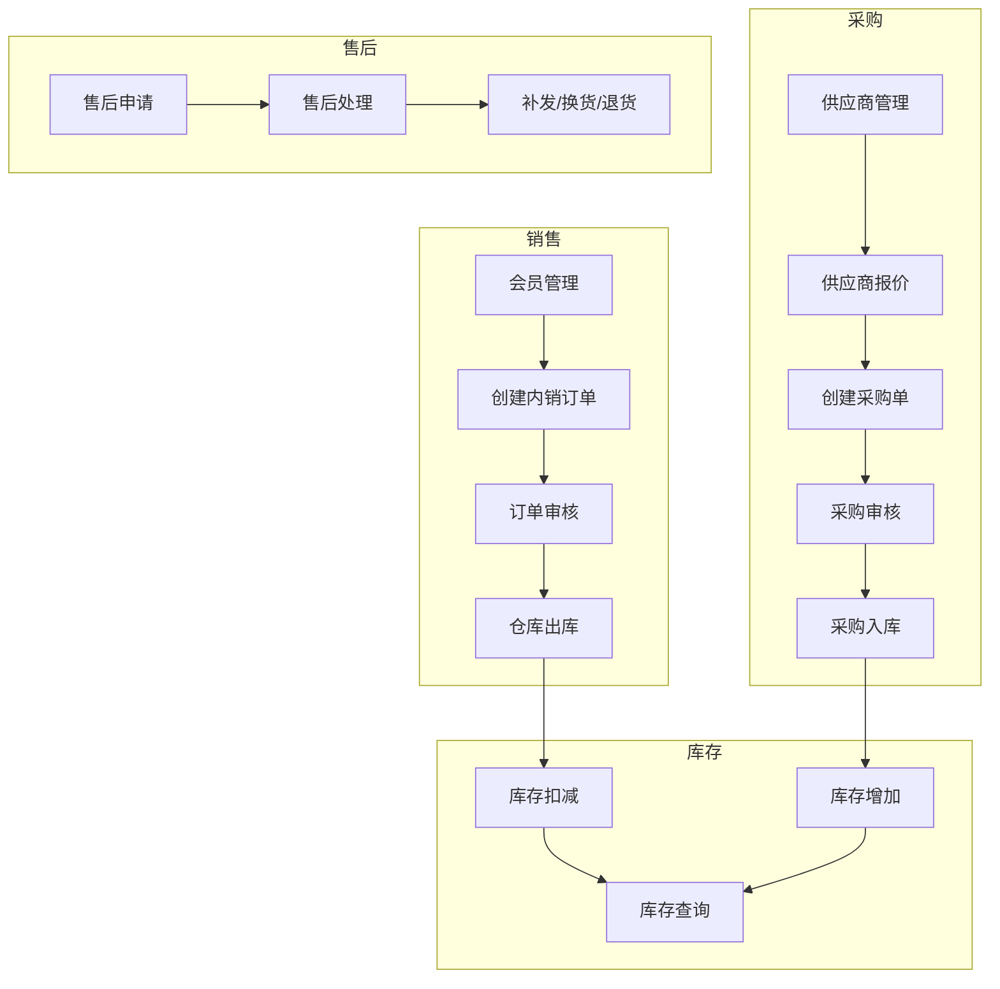
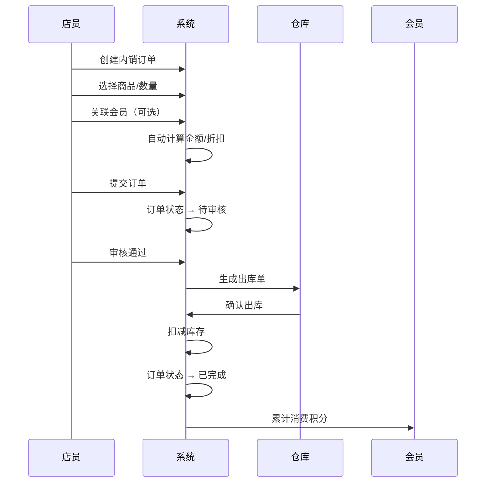
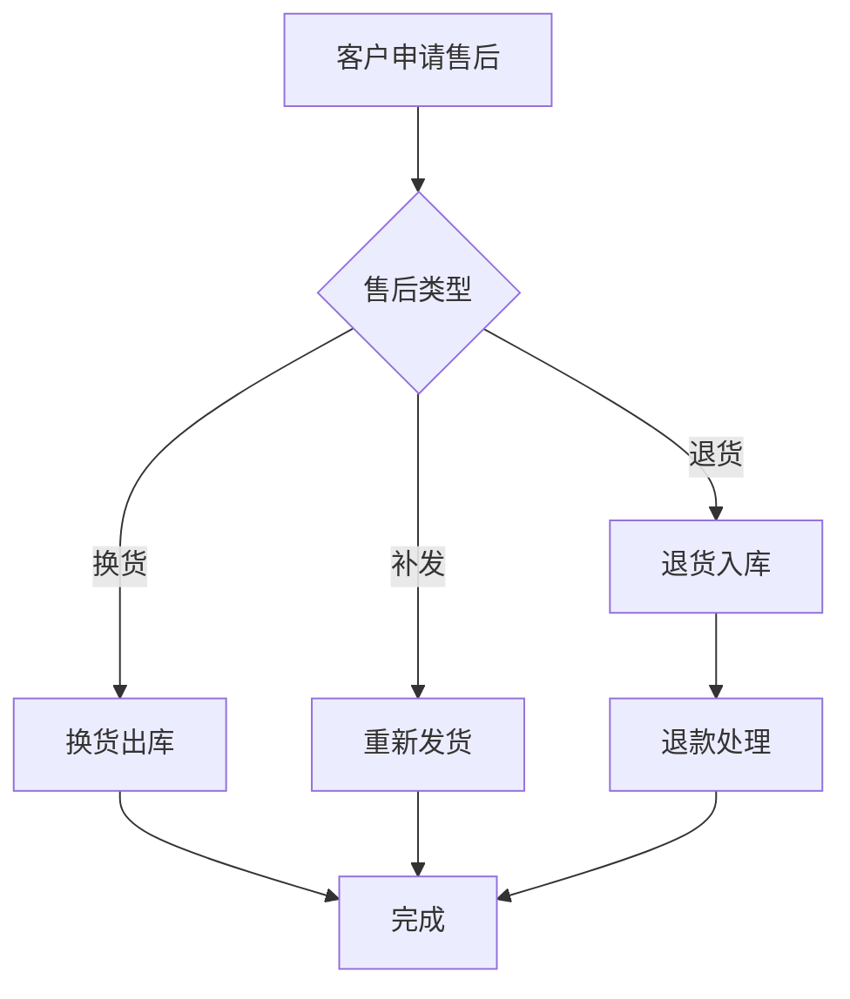

# 启航零售ERP — 零售数字化管理平台

> **开源、轻量、可扩展的零售业务管理平台。基于电商ERP扩展，支持线上电商订单管理 + 线下POS收银 + 即时零售对接（美团闪购/淘宝闪购/京东到家/抖音小时达）。帮助零售商实现商品、采购、库存、销售、会员全链路数字化管理。**


---

**POS收银台**


**管理视图**


## 📖 目录

- [一、系统概述](#一系统概述)
- [二、开发状态](#二开发状态)
- [三、适用场景](#三适用场景)
- [四、核心功能详解](#四核心功能详解)
- [五、业务流程图](#五业务流程图)
- [六、角色与权限](#六角色与权限)
- [七、技术架构](#七技术架构)
- [八、快速开始](#八快速开始)
- [九、配置说明](#九配置说明)
- [十、部署指南](#十部署指南)
- [十一、数据模型](#十一数据模型)
- [十二、API 概览](#十二-api-概览)
- [十三、常见问题](#十三常见问题)
- [十四、开源生态](#十四开源生态)

---

## 一、系统概述

### 1.1 什么是启航零售ERP？

启航零售ERP 是一个面向零售企业的开源业务管理平台。它将零售企业最核心的**商品管理、采购管理、库存管理、销售管理、售后管理、会员管理**等环节整合到一个统一平台，帮助零售商实现从进货到销售的全链路数字化。

**当前状态**：已实现电商ERP核心功能（OMS订单管理、商品/库存/采购/供应商/仓储），正在扩展线下POS收银和即时零售对接能力。

### 1.2 解决的问题

| 业务痛点 | 系统方案 |
|---------|---------|
| 商品信息分散在 Excel 中，查询困难 | 统一商品库，分类/品牌/规格/属性结构化存储 |
| 采购靠电话微信，无流程记录 | 采购单全流程管理，从询价到入库完整追溯 |
| 库存数据滞后，盘点靠人工 | 实时库存更新，出入库自动扣增，库存明细随时可查 |
| 销售无记录，业绩难统计 | 内销订单数字化，销售数据自动汇总 |
| 会员信息散乱，无消费记录 | 会员档案统一管理，消费记录可追溯 |
| 多人协作权限不清 | RBAC 角色权限，精细控制每个功能访问 |
| 线下门店收银效率低 | Electron POS收银端，支持离线+硬件外设 |
| 即时零售平台订单处理混乱 | 对接美团/淘宝/京东/抖音，订单统一管理 |

### 1.3 系统定位

```
┌─────────────────────────────────────────────────────────────┐
│                    启航零售ERP                                │
│  ┌─────────────────┐  ┌─────────────────┐  ┌──────────────┐│
│  │  电商ERP（已有）  │  │  POS收银（开发中） │  │ 即时零售（规划）││
│  │  · OMS订单管理   │  │  · 收银台        │  │ · 美团闪购    ││
│  │  · 商品/库存     │  │  · 会员/储值     │  │ · 淘宝闪购    ││
│  │  · 采购/供应商   │  │  · 班次/小票     │  │ · 京东到家    ││
│  │  · 财务/报表     │  │  · 营销/促销     │  │ · 抖音小时达  ││
│  └─────────────────┘  └─────────────────┘  └──────────────┘│
├─────────────────────────────────────────────────────────────┤
│          技术底座：Spring Boot 4.1 + Vue 3.5 + Electron      │
├─────────────────────────────────────────────────────────────┤
│          双客户端形态：Web端（浏览器） + 桌面端（本地安装）     │
└─────────────────────────────────────────────────────────────┘
```

**双客户端形态**：
- **Vue Web端**：浏览器访问，适合有服务器的商户
- **Electron桌面端**：本地安装，支持硬件驱动（打印机/扫码枪/钱箱）

---

## 二、开发状态

| 模块 | 状态 | 说明 |
|------|:---:|------|
| 电商ERP（OMS订单管理） | ✅ 已完成 | 淘宝/京东/拼多多/抖店/微信/快手/小红书 |
| 商品管理 | ✅ 已完成 | SPU/SKU/分类/品牌/规格属性 |
| 库存管理 | ✅ 已完成 | 多仓库/出入库/盘点/库存预警 |
| 采购管理 | ✅ 已完成 | 采购订单/入库/供应商管理 |
| 仓储管理 | ✅ 已完成 | 仓库/仓位/调拨 |
| 系统管理 | ✅ 已完成 | 用户/角色/菜单/字典/日志 |
| 会员管理 | ✅ 已完成 | 复用 `oms_shop_member`（扩展字段） |
| 营业员管理 | ✅ 已完成 | 复用 `erp_sales_person`（扩展字段） |
| 门店管理 | ✅ 已完成 | 复用 `o_shop`（type=999） |
| 营销促销 | ✅ 已完成 | 复用 `o_marketing_discount_rule` |
| Vue Web端（管理后台+POS） | ✅ 已完成 | 浏览器访问，完整功能 |
| Electron桌面端 | 🚧 开发中 | 本地安装，管理后台+POS+硬件驱动 |
| 即时零售 | 📋 规划中 | 美团/淘宝/京东/抖音对接 |

---

## 三、适用场景

### 3.1 目标用户

| 用户类型 | 典型场景 |
|---------|---------|
| **线下品牌零售商** | 拥有多家门店，需要统一管理商品、库存、采购 |
| **批发商/经销商** | 有稳定的供应商和客户，需要采购和销售管理 |
| **中小型连锁店** | 需要管理多门店商品信息、会员信息 |
| **商贸公司** | 有进销存全链路管理需求 |
| **个体商户升级** | 从 Excel 手工记账向系统化管理转型 |

### 3.2 典型业务场景

**场景一：便利店进货到销售**

```
采购员创建采购单 → 经理审核 → 供应商发货 → 
→ 仓库收货入库 → 库存更新 → 门店上架销售 → 
→ 客户购买 → 收银开单 → 库存扣减
```

**场景二：会员到店消费**

```
会员到店 → 员工录入内销订单 → 选择会员 → 
→ 享受折扣价 → 支付完成 → 订单审核 → 
→ 仓库出库 → 会员积分累计
```

**场景三：多门店调拨**

```
A 门店库存不足 → 创建调拨单 → 
→ B 门店出库 → A 门店入库 → 库存同步更新
```

---

## 四、核心功能详解

### 4.1 商品管理

商品管理是零售业务的基础。系统提供完整的商品信息管理能力。

#### 商品库管理

- **商品信息**：商品名称、编码、条码、规格、单位、价格（进价/售价/会员价）
- **SKU 管理**：同一商品支持多规格（如颜色、尺寸），每个 SKU 独立管理库存
- **分类体系**：多级商品分类，支持树形结构
- **品牌管理**：商品品牌统一维护
- **规格属性**：分类级联规格属性配置，如服装类有颜色、尺码

```
商品 ── 品牌 (1:1)
 ├── 分类 (N:1)
 ├── SKU1 ── 库存
 ├── SKU2 ── 库存
 └── SKU3 ── 库存
```

#### 供应商产品

记录每个供应商提供的商品及价格信息，便于采购时快速比价。

| 功能 | 说明 |
|------|------|
| 商品-供应商关联 | 一个商品可对应多个供应商 |
| 供应商价格 | 记录不同供应商的报价 |
| 价格历史 | 供应商价格变更记录可追溯 |

### 4.2 采购管理

采购管理覆盖从采购需求到入库的全流程。

#### 采购订单

```
创建采购单 → 提交审核 → 审核通过 → 供应商发货 → 采购入库 → 完成
```

- **采购单创建**：选择供应商、商品、数量、价格，自动计算采购金额
- **采购单状态**：待审核 / 已审核 / 已入库 / 已完成 / 已取消
- **采购入库**：到货后入库，支持分批入库
- **历史查询**：按供应商、商品、日期等多维度查询

#### 供应商管理

- **供应商档案**：名称、联系人、电话、地址、结算方式
- **供应商报价**：按商品记录供应商报价，采购时自动引用
- **采购承运商**：物流承运商信息维护

### 4.3 仓库管理

仓库管理实现商品实物的精细化管控。

#### 仓库与仓位

- **多仓库**：支持多个仓库独立管理
- **仓位管理**：仓库内细分仓位，精确定位商品存放位置

#### 出入库管理

| 类型 | 说明 |
|------|------|
| **采购入库** | 采购单到货后入库，增加库存 |
| **销售出库** | 内销订单审核后出库，扣减库存 |
| **调拨出入库** | 仓库间商品调拨 |
| **盘点调整** | 盘点后库存调整 |

#### 库存查询

- 实时库存：按仓库、商品、SKU 查看当前库存
- 库存流水：每次出入库操作均有记录，可追溯

### 4.4 销售管理（内销）

内销管理是零售业务的核心环节，处理线下门店的销售业务。

#### 内销订单

**订单生命周期：**

```
创建草稿 → 提交审核 → 审核通过 → 出库发货 → 完成
      ↓                        ↓
    驳回修改                 取消订单
```

- **创建订单**：选择商品、数量，自动带出价格，支持折扣
- **会员关联**：可选择会员，享受会员价和积分
- **审核流程**：订单需审核后才能出库
- **多种状态**：待审核 / 已审核 / 已出库 / 已完成 / 已取消

#### 折扣管理

- **折扣规则**：按商品、分类、会员等级配置折扣
- **促销活动**：满减、打折、特价等多种促销方式

### 4.5 会员管理

会员管理帮助零售商沉淀客户资产。

| 功能 | 说明 |
|------|------|
| 会员档案 | 姓名、手机号、等级、积分、消费记录 |
| 会员等级 | 不同等级享受不同折扣 |
| 积分管理 | 消费自动累计积分，积分可抵扣 |
| 消费记录 | 会员历史订单查询 |

### 4.6 Electron桌面端（开发中）

Electron桌面端是一个**完整的本地安装应用**，包含管理后台和POS收银两大功能模块。所有业务逻辑调用Java后端API，Electron只负责UI渲染和硬件驱动对接。

**架构设计**：
```
┌─────────────────────────────────────────────────────────────┐
│                    Java后端（业务逻辑核心）                     │
│              所有业务逻辑 + 数据存储 + API接口                  │
└─────────────────────────────────────────────────────────────┘
                              ↑
                    所有操作都调用API
                    ↑                   ↑
        ┌─────────────────┐   ┌─────────────────┐
        │   Vue Web端      │   │ Electron桌面端   │
        │   浏览器访问      │   │ 本地安装          │
        │   管理后台+POS   │   │ 管理后台+POS     │
        │                  │   │ + 硬件驱动        │
        └─────────────────┘   └─────────────────┘
```

**Electron职责**：
- ✅ UI渲染（复用Vue组件）
- ✅ 硬件驱动（打印机、扫码枪、钱箱、电子秤）
- ❌ 不做业务逻辑（全部转发给Java后端）
- ❌ 不做本地数据库（所有数据存储在MySQL）

**功能模块**：

| 模块 | 功能 | 说明 |
|------|------|------|
| **登录** | 账号密码登录 | 调用Java API |
| **首页** | 数据看板 | 调用Java API |
| **商品管理** | 商品CRUD、SKU、分类、品牌 | 调用Java API |
| **库存管理** | 入库/出库/盘点/预警 | 调用Java API |
| **会员管理** | 会员CRUD、积分、储值 | 调用Java API |
| **订单管理** | 订单列表/详情/统计 | 调用Java API |
| **采购管理** | 采购单/供应商 | 调用Java API |
| **POS收银** | 收银台/支付/打印 | 调用Java API + 本地硬件 |
| **系统设置** | 用户/角色/字典 | 调用Java API |

**POS收银功能**：

| 功能 | 说明 |
|------|------|
| 收银台 | 扫码枪/键盘输入，支持计件/称重商品 |
| 支付方式 | 现金/微信/支付宝/银行卡/会员余额/组合支付 |
| 班次管理 | 开班/交班/班次对账 |
| 小票打印 | USB/网口打印机（ESC/POS指令）+ 云打印 |
| 退货退款 | 整单/部分退货，原路退回/现金/余额 |
| 硬件对接 | 电子秤（RS232串口）、钱箱、客显屏 |

**与Vue Web端对比**：

| 维度 | Vue Web端 | Electron桌面端 |
|------|----------|---------------|
| 功能 | 完整（管理+POS） | 完整（管理+POS） |
| 部署 | 浏览器访问 | 本地安装 |
| 硬件 | 无 | 打印机/扫码枪/钱箱 |
| 网络 | 需要网络 | 需要网络 |
| 后端 | Java | Java（同一套） |
| 前端代码 | Vue | Vue（复用） |

### 4.7 即时零售对接（规划中）

对接主流即时零售平台，实现订单/库存/商品统一管理。

| 平台 | 平台ID | 对接内容 |
|------|--------|----------|
| 美团闪购 | 1100 | 商品同步/订单拉取/配送呼叫 |
| 淘宝闪购 | 1200 | 商品同步/订单拉取/配送对接 |
| 京东到家 | 1300 | 商品同步/订单拉取/达达配送 |
| 抖音小时达 | 1400 | 商品同步/订单拉取/直播联动 |

### 4.8 发货管理

| 菜单 | 说明 |
|------|------|
| 手动发货 | 手工录入发货物流信息 |
| 打单发货 | 电子面单批量打印发货 |
| 供应商发货 | 订单分配给供应商代发 |
| 云仓发货 | 推送到第三方云仓发货 |
| 发货记录 | 所有发货记录查询 |
| 电子面单设置 | 快递电子面单账户配置 |
| 发货快递设置 | 默认发货快递配置 |

### 4.9 售后管理

| 菜单 | 说明 |
|------|------|
| 售后库 | 所有售后单统一查询、处理 |
| 售后台账 | 售后处理结果记录台账 |

### 4.10 通知渠道

系统支持对接外部即时通讯工具，将运营异常及时推送给相关人员。

- **飞书机器人**：Webhook 推送
- **钉钉机器人**：支持签名校验
- **企业微信机器人**：Webhook 推送

---

## 五、业务流程图

### 4.1 零售业务总览



### 4.2 内销订单流程



### 4.3 采购到销售全链路


### 4.4 售后处理流程



---

## 六、角色与权限

系统采用 RBAC（基于角色的访问控制）模型，可实现精细化的权限管理。

### 5.1 预设角色参考

| 角色 | 主要权限 | 适用人员 |
|------|---------|---------|
| **管理员** | 全部功能 | 系统管理员 |
| **采购员** | 采购单创建、供应商管理、采购入库 | 采购部门 |
| **仓库员** | 出入库操作、库存查询、仓位管理 | 仓库人员 |
| **销售员** | 内销订单创建/审核、会员管理 | 门店销售人员 |
| **商品管理员** | 商品库维护、分类/品牌管理 | 商品运营 |
| **财务** | 订单查询、报表查看 | 财务人员 |

### 5.2 权限控制粒度

- **功能权限**：控制菜单和按钮的可见性
- **数据权限**：控制数据访问范围（如仅本部门数据）
- **操作权限**：增删改查独立控制

---

## 七、技术架构

### 6.1 技术栈

| 层级 | 组件 | 版本 | 说明 |
|------|------|------|------|
| **后端框架** | Spring Boot | 4.1.0 | 业务逻辑核心 |
| **安全框架** | Spring Security | 7.1.0 | 认证授权 |
| **持久层** | MyBatis-Plus | 3.5.16 | ORM框架 |
| **数据库** | MySQL | 8 | 数据存储 |
| **缓存** | Redis | 7.x | 缓存/会话 |
| **Web前端** | Vue | 3.5 | 管理后台UI |
| **前端语言** | TypeScript | 5.x | 类型安全 |
| **UI 框架** | Element Plus | 最新 | 组件库 |
| **构建工具** | Vite | 8 | 前端构建 |
| **桌面端** | Electron | 30+ | 本地安装应用 |
| **JDK** | Java | 17 | 后端运行时 |
| **Node.js** | - | 20+ | 前端/桌面端构建 |

### 6.2 项目结构

```
qihang-retail/
│
├── vue/                          # Web前端（管理后台+POS）
│   ├── src/
│   │   ├── views/                # 页面组件
│   │   ├── api/                  # API接口
│   │   ├── components/           # 通用组件
│   │   ├── router/               # 路由配置
│   │   ├── store/                # Pinia状态管理
│   │   └── utils/                # 工具函数
│   └── package.json
│
├── electron/                     # Electron桌面端
│   ├── src/
│   │   ├── main/                 # 主进程
│   │   │   ├── index.ts          # 入口
│   │   │   ├── hardware/         # 硬件驱动
│   │   │   │   ├── printer.ts    # 打印机驱动
│   │   │   │   ├── scanner.ts    # 扫码枪驱动
│   │   │   │   ├── drawer.ts     # 钱箱驱动
│   │   │   │   └── scale.ts      # 电子秤驱动
│   │   │   └── ipc/              # IPC通信
│   │   │       └── handlers.ts   # 硬件操作处理器
│   │   │
│   │   ├── renderer/             # 渲染进程
│   │   │   ├── views/            # 页面组件（复用vue）
│   │   │   ├── api/              # API调用（调用Java后端）
│   │   │   ├── components/       # 通用组件（复用vue）
│   │   │   └── utils/            # 工具函数
│   │   │
│   │   └── preload.ts            # 预加载脚本
│   │
│   ├── electron-builder.yml      # 打包配置
│   ├── package.json
│   └── README.md
│
├── common/                       # Java公共模块
│   └── src/main/java/cn/qihangerp/common/
│
├── security/                     # Java安全模块
│   └── src/main/java/cn/qihangerp/security/
│
├── model/                        # Java领域模型
│   └── src/main/java/cn/qihangerp/
│
├── mapper/                       # Java数据访问
│   └── src/main/java/cn/qihangerp/mapper/
│
├── service/                      # Java业务逻辑
│   └── src/main/java/cn/qihangerp/service/
│
├── erp-api/                      # Spring Boot主应用
│   ├── src/main/java/cn/qihangerp/erp/
│   │   ├── ErpApi.java           # 启动类
│   │   ├── controller/
│   │   │   ├── erp/              # 核心业务控制器
│   │   │   └── sys/              # 系统管理控制器
│   │   └── config/               # 全局配置
│   └── src/main/resources/
│       ├── application.yml
│       └── application-dev.yml
│
├── docs/                         # 文档
└── README.md
```

### 6.3 双客户端架构

```
┌─────────────────────────────────────────────────────────────┐
│                    客户端层                                  │
│  ┌──────────────────┐  ┌──────────────────────────────┐    │
│  │ Vue Web端        │  │ Electron桌面端               │    │
│  │ (Vue3 + 浏览器)  │  │ (Vue3 + Electron)            │    │
│  │                  │  │                              │    │
│  │ · 管理后台       │  │ · 管理后台（完整功能）       │    │
│  │ · POS收银        │  │ · POS收银（完整功能）        │    │
│  │                  │  │ · 硬件驱动（打印机/扫码枪）   │    │
│  └────────┬─────────┘  └──────────────┬───────────────┘    │
└───────────┼───────────────────────────┼─────────────────────┘
            │  HTTP + JWT              │  HTTP + JWT
┌───────────▼───────────────────────────▼─────────────────────┐
│  后端API层 (Spring Boot)                                    │
│  ┌────────┬────────┬────────┬────────┬────────┬───────┐   │
│  │  sys   │ goods  │  pos   │ member │ market │finance│   │
│  ├────────┼────────┼────────┼────────┼────────┼───────┤   │
│  │inventory│purchase│ store  │ report │  oms   │channel│   │
│  └────────┴────────┴────────┴────────┴────────┴───────┘   │
└────────────────────────┬────────────────────────────────────┘
                         │
┌────────────────────────▼────────────────────────────────────┐
│  数据层: MySQL 8 + Redis 7                                  │
└─────────────────────────────────────────────────────────────┘
```

### 6.4 模块依赖

```
    erp-api (Spring Boot主应用)
       │
       ├──→ security (安全认证)
       │       │
       │       └──→ common (公共工具)
       │
       ├──→ service (业务逻辑)
       │       │
       │       └──→ mapper (数据访问)
       │               │
       │               └──→ model (领域模型)
       │
       └──→ common
```

### 6.4 数据模型

#### 核心表结构

```
o_goods          ← 商品库
o_goods_sku      ← 商品 SKU
o_goods_category ← 商品分类
o_goods_brand    ← 商品品牌
o_goods_spec     ← 商品规格

o_supplier       ← 供应商
o_supplier_product ← 供应商产品
o_purchase_order ← 采购订单
o_purchase_order_item ← 采购订单明细

s_warehouse      ← 仓库
s_warehouse_pos  ← 仓位
s_stock          ← 库存
s_stock_log      ← 库存流水

o_order          ← 内销订单（erp_order 业务订单）
o_order_item     ← 内销订单明细

sys_user         ← 系统用户
sys_role         ← 角色
sys_menu         ← 菜单
sys_dept         ← 部门
```

---

## 八、快速开始

### 7.1 环境要求

| 组件 | 最低版本 | 备注 |
|------|---------|------|
| JDK | 17 | 必须 JDK 17+ |
| Node.js | 20 | 推荐 20.20.0 |
| Maven | 3.9 | 构建工具 |
| MySQL | 8 | 数据库 |
| Redis | 7 | 缓存 |

### 7.2 数据库初始化

```bash
# 创建数据库
mysql -u root -p -e "CREATE DATABASE IF NOT EXISTS \`qihang-retail\` DEFAULT CHARACTER SET utf8mb4 COLLATE utf8mb4_unicode_ci;"

# 导入数据表结构
mysql -u root -p qihang-retail < docs/qihang-retail.sql
```

### 7.3 启动后端

```bash
# 克隆项目
git clone https://github.com/zeasin/qihang-retail.git
cd qihang-retail

# 编译打包
mvn clean install -DskipTests

# 启动
java -jar erp-api/target/erp-api-4.1.0.jar
```

启动后访问 `http://localhost:8088` 验证后端服务。

### 7.4 启动Web前端

```bash
cd vue
npm install
npm run dev
```

启动后访问 `http://localhost:88`。

### 7.5 启动Electron桌面端

```bash
cd electron
npm install
npm run dev
```

启动后Electron桌面端会自动打开，连接Java后端 `http://localhost:8088`。

### 7.6 登录系统

- 默认账号：`admin`
- 默认密码：`QHerp@23`

---

## 九、配置说明

### 8.1 环境切换

`erp-api/src/main/resources/application.yml`：

```yaml
spring:
  profiles:
    active: dev   # 可选：dev（开发）、demo（演示）
```

### 8.2 数据库配置

```yaml
spring:
  datasource:
    driverClassName: com.mysql.cj.jdbc.Driver
    url: jdbc:mysql://127.0.0.1:3306/qihang-retail?useUnicode=true&characterEncoding=utf8&serverTimezone=GMT%2B8
    username: root
    password: your_password
    hikari:
      maximum-pool-size: 10
      minimum-idle: 5
```

### 8.3 Redis 配置

```yaml
spring:
  data:
    redis:
      host: 127.0.0.1
      port: 6379
      database: 0
      timeout: 10s
      lettuce:
        pool:
          min-idle: 0
          max-idle: 8
          max-active: 8
```

### 8.4 Token 配置

```yaml
token:
  expireTime: 60       # Token 过期时间（分钟）
  secret: your-secret-key-here
```

---

## 十、部署指南

### 9.1 后端部署

#### JAR 部署

```bash
# 打包（跳过测试）
mvn clean package -DskipTests

# 后台启动
nohup java -jar erp-api/target/erp-api.jar > erp.log 2>&1 &
```

#### 系统服务（Linux systemd）

```ini
[Unit]
Description=qihang-retail
After=syslog.target

[Service]
User=root
ExecStart=/usr/bin/java -jar /opt/qihang-retail/erp-api.jar
SuccessExitStatus=143
Restart=always
RestartSec=10

[Install]
WantedBy=multi-user.target
```

### 9.2 Web前端部署

```bash
cd vue
npm run build
# 构建产物在 vue/dist/ 目录
```

### 9.3 Electron桌面端打包

```bash
cd electron
npm install

# 打包Windows版本
npm run build:win

# 打包macOS版本
npm run build:mac

# 打包Linux版本
npm run build:linux
```

打包产物在 `electron/dist/` 目录，可直接分发给用户安装。

### 9.4 Nginx 配置

```nginx
# 前端静态资源
server {
    listen 80;
    server_name your-domain.com;
    
    # API 代理
    location /prod-api/ {
        proxy_set_header Host $http_host;
        proxy_set_header X-Real-IP $remote_addr;
        proxy_set_header REMOTE-HOST $remote_addr;
        proxy_set_header X-Forwarded-For $proxy_add_x_forwarded_for;
        proxy_pass http://127.0.0.1:8088/;
    }
    
    # 前端页面
    location / {
        root /opt/qihang-retail/vue/dist;
        try_files $uri $uri/ /index.html;
        index index.html;
    }
}
```

### 9.5 Docker 部署

```dockerfile
FROM openjdk:17-jdk-slim
COPY erp-api/target/erp-api.jar /app/app.jar
EXPOSE 8088
ENTRYPOINT ["java", "-jar", "/app/app.jar"]
```

---

## 十一、数据模型

### 10.1 商品相关

```
o_goods                          ← 商品库
├── id            BIGINT PK
├── name          VARCHAR(200)    商品名称
├── goods_num     VARCHAR(100)    商品编码
├── bar_code      VARCHAR(100)    条码
├── category_id   BIGINT          分类ID
├── brand_id      BIGINT          品牌ID
├── unit_name     VARCHAR(20)     单位
├── retail_price  DECIMAL         零售价
├── pur_price     DECIMAL         采购价
├── merchant_id   BIGINT          商户ID
├── shop_id       BIGINT          店铺ID
├── is_weighted   TINYINT         是否称重（扩展）
├── shelf_date_type TINYINT       保质期录入方式（扩展）
├── status        INT             状态
└── ...

o_goods_sku                      ← 商品SKU
├── id            BIGINT PK
├── goods_id      BIGINT          商品ID
├── sku_code      VARCHAR(100)    SKU编码
├── bar_code      VARCHAR(100)    条码
├── price         DECIMAL         售价
├── cost_price    DECIMAL         成本价
└── spec_info     VARCHAR(500)    规格信息（JSON）

o_goods_category                 ← 商品分类
├── id            BIGINT PK
├── name          VARCHAR(50)     分类名称
├── parent_id     BIGINT          父分类ID
├── merchant_id   BIGINT          商户ID
└── image         VARCHAR(255)    分类图标

o_goods_brand                    ← 商品品牌
├── id            BIGINT PK
├── name          VARCHAR(50)     品牌名称
└── merchant_id   BIGINT          商户ID
```

### 10.2 订单相关

```
o_order                          ← OMS订单（电商+即时零售）
├── id            BIGINT PK
├── order_num     VARCHAR(50)     订单号
├── shop_id       BIGINT          店铺ID
├── shop_type     INT             平台类型（1淘宝/2京东/.../1100美团闪购）
├── order_status  INT             订单状态
├── total_amount  DECIMAL         订单金额
├── receiver_name VARCHAR(50)     收货人
├── receiver_mobile VARCHAR(20)   收货电话
├── address       VARCHAR(255)    收货地址
├── delivery_type TINYINT         配送方式（扩展）
├── store_id      BIGINT          履约门店（扩展）
├── merchant_id   BIGINT          商户ID
├── create_time   DATETIME        创建时间
└── ...

o_order_item                     ← 订单明细
├── id            BIGINT PK
├── order_id      BIGINT          订单ID
├── goods_name    VARCHAR(200)    商品名称
├── sku_id        BIGINT          SKU ID
├── quantity      INT             数量
├── price         DECIMAL         单价
└── subtotal      DECIMAL         小计

erp_sales_order                  ← 内销订单（POS销售单）
├── id            BIGINT PK
├── order_no      VARCHAR(50)     订单号
├── member_id     BIGINT          会员ID
├── total_amount  DECIMAL         订单金额
├── status        INT             状态
├── salesman_id   BIGINT          营业员ID
└── create_time   DATETIME        创建时间
```

### 10.3 采购相关

```
erp_purchase_order               ← 采购订单
├── id            BIGINT PK
├── order_no      VARCHAR(50)     采购单号
├── supplier_id   BIGINT          供应商ID
├── merchant_id   BIGINT          商户ID
├── warehouse_id  BIGINT          仓库ID
├── total_amount  DECIMAL         采购金额
├── status        INT             状态
└── create_time   DATETIME        创建时间

erp_purchase_order_item          ← 采购订单明细
├── id            BIGINT PK
├── purchase_id   BIGINT          采购单ID
├── sku_id        BIGINT          SKU ID
├── quantity      INT             采购数量
├── price         DECIMAL         采购单价
└── received_qty  INT             已入库数量

erp_supplier                     ← 供应商
├── id            BIGINT PK
├── name          VARCHAR(100)    供应商名称
├── contact       VARCHAR(50)     联系人
├── phone         VARCHAR(20)     联系电话
└── merchant_id   BIGINT          商户ID
```

### 10.4 库存相关

```
o_goods_inventory                ← 商品库存
├── id            BIGINT PK
├── goods_id      BIGINT          商品ID
├── sku_id        BIGINT          SKU ID
├── warehouse_id  BIGINT          仓库ID
├── merchant_id   BIGINT          商户ID
├── shop_id       BIGINT          店铺ID
├── store_id      BIGINT          门店ID（扩展）
├── quantity      INT             库存数量
├── locked_quantity INT           锁定数量
└── available_quantity INT        可用数量

erp_warehouse                    ← 仓库
├── id            BIGINT PK
├── name          VARCHAR(100)    仓库名称
├── merchant_id   BIGINT          商户ID
├── shop_id       BIGINT          店铺ID
├── store_id      BIGINT          门店ID（扩展）
└── warehouse_type TINYINT        仓库类型
```

---

## 十二、API 概览

所有 API 统一返回 `ResultVo<T>` 格式：

```json
{
    "code": 200,
    "msg": "操作成功",
    "data": {}
}
```

### 核心 API 列表

| 模块 | 方法 | 路径 | 说明 |
|------|------|------|------|
| **认证** | POST | `/api/sys-api/login` | 用户登录 |
| | GET | `/api/sys-api/getInfo` | 获取用户信息 |
| **商品** | GET | `/api/erp-api/goods/list` | 商品列表 |
| | POST | `/api/erp-api/goods/add` | 新增商品 |
| | PUT | `/api/erp-api/goods/edit` | 编辑商品 |
| | DELETE | `/api/erp-api/goods/del` | 删除商品 |
| | GET | `/api/erp-api/goodsSku/list` | SKU 列表 |
| **采购** | GET | `/api/erp-api/purchase/list` | 采购单列表 |
| | POST | `/api/erp-api/purchase/add` | 创建采购单 |
| | POST | `/api/erp-api/purchase/audit` | 审核采购单 |
| | POST | `/api/erp-api/purchase/stockIn` | 采购入库 |
| **库存** | GET | `/api/erp-api/stock/list` | 库存列表 |
| | GET | `/api/erp-api/stock/log` | 库存流水 |
| **内销** | GET | `/api/erp-api/order/list` | 内销订单列表 |
| | POST | `/api/erp-api/order/add` | 创建内销订单 |
| | POST | `/api/erp-api/order/audit` | 审核订单 |
| **会员** | GET | `/api/erp-api/member/list` | 会员列表 |
| | POST | `/api/erp-api/member/add` | 新增会员 |
| **系统** | GET | `/api/sys-api/user/list` | 用户列表 |
| | GET | `/api/sys-api/role/list` | 角色列表 |
| | GET | `/api/sys-api/menu/list` | 菜单列表 |

---

## 十三、常见问题

### 启动报错：数据库连接失败

```
CannotGetJdbcConnectionException: Failed to obtain JDBC Connection
```

**解决：** 确认 MySQL 已启动，检查 `application.yml` 中的数据库地址、用户名、密码是否正确。

### 启动报错：Redis 连接失败

```
RedisConnectionFailureException: Unable to connect to Redis
```

**解决：** 确认 Redis 已启动，检查 `application.yml` 中的 Redis 配置。

### 登录后页面空白

**解决：** 按 F12 打开开发者工具，查看 Console 和 Network 标签。确认 API 请求是否正常返回，Token 是否正确传递。

### 前端打包后访问接口 404

**解决：** 确认 Nginx 配置中 `/prod-api/` 的 proxy_pass 已正确配置，且后端服务已启动。

---

## 十四、开源生态

启航开源项目矩阵：

| 项目               | 定位                 | 官网 | Gitee | GitHub                                              |
|:-------------------|:---------------------|:-----|:------|:----------------------------------------------------|
| **启航零售ERP ⬅** | **线下零售管理平台** | [官网](https://qihangerp.cn/open/retail-erp.html) | [Gitee](https://gitee.com/qiliping/qihang-retail) | [GitHub](https://github.com/zeasin/qihang-retail)   |
| 启航电商ERP        | 电商业务 AI 底座     | [官网](https://qihangerp.cn/open/erp.html) | [Gitee](https://gitee.com/qiliping/qihang-erp-open) | [GitHub](https://github.com/zeasin/qihang-erp-open) |
| OMS 订单中台       | 轻量级订单管理       | [官网](https://qihangerp.cn/open/oms.html) | [Gitee](https://gitee.com/qiliping/qihang-oms) | [GitHub](https://github.com/zeasin/qihang-oms)      |
| 启航跨境电商ERP    | 跨境电商专用版       | [官网](https://qihangerp.cn/open/cross-border.html) | [Gitee](https://gitee.com/qiliping/qihang-cb-erp) | [GitHub](https://github.com/zeasin/qihang-cb-erp)                                          |

---

## 企业版

如需多商户架构、专业技术支持、功能定制、私有化部署等，请联系：

| 方式 | 信息 |
|------|------|
| 企业版 | https://qihangerp.cn |

---

> 💖 启航零售ERP 持续开源迭代中。如果项目对您有帮助，请点个 **Star ⭐** 给予鼓励！
> 
> 项目还在成长阶段，如有任何问题或建议，欢迎提交 [Issue](https://github.com/zeasin/qihang-retail/issues) 反馈。
